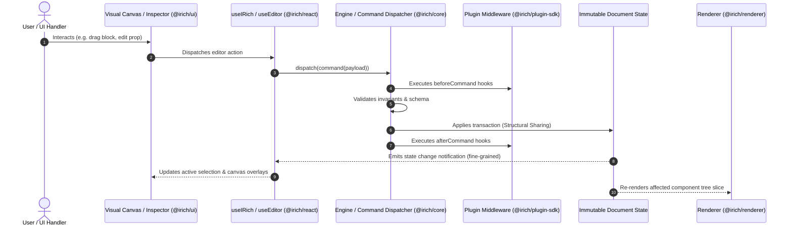

# iRich Architecture & System Design

> High-level system architecture, package hierarchy, runtime boundaries, and data flow for **iRich**.

---

## 1. System Overview & Layered Architecture

iRich is an embeddable, extensible visual content editor and page builder for React. It unites structured rich-text editing (inspired by ProseMirror/Tiptap ergonomics) and component-based page composition (inspired by visual block builders) into a single, cohesive engine.

### Layer Diagram

```
                       +---------------------------------------+
                       |                 iRich                 |
                       +---------------------------------------+
                                           |
                 +-------------------------+-------------------------+
                 |                         |                         |
       +-------------------+     +-------------------+     +-------------------+
       |   Visual Editor   |     |     Rich Text     |     |      Plugins      |
       |   (@irich/ui)     |     | (@irich/rich-text)|     | (@irich/plugin-sdk|
       +-------------------+     +-------------------+     +-------------------+
                 |                         |                         |
                 +-------------------------+-------------------------+
                                           |
                       +---------------------------------------+
                       |            Document Engine            |
                       |             (@irich/core)             |
                       +---------------------------------------+
                                           |
                       +---------------------------------------+
                       |          Component Registry           |
                       |             (@irich/core)             |
                       +---------------------------------------+
                                           |
                       +---------------------------------------+
                       |               Renderer                |
                       |           (@irich/renderer)           |
                       +---------------------------------------+
                                           |
                       +---------------------------------------+
                       |           React Integration           |
                       |             (@irich/react)            |
                       +---------------------------------------+
```

---

## 2. Package Responsibility Matrix

To preserve clear architectural boundaries and enforce framework independence, responsibilities are partitioned strictly across dedicated packages:

| Package                 | Purpose & Scope                                                                                                                                                               | Runtime Dependencies                                                                                         | Framework Constraints                                                                                         |
| :---------------------- | :---------------------------------------------------------------------------------------------------------------------------------------------------------------------------- | :----------------------------------------------------------------------------------------------------------- | :------------------------------------------------------------------------------------------------------------ |
| **`@irich/core`**       | Canonical JSON data model, state machine, command dispatch, transaction pipeline, structural validation, document invariants, component registry contracts.                   | Zero external dependencies (pure JS/TS).                                                                     | **Zero React / DOM / Next.js / Browser dependencies.** Runs in pure Node.js, Web Workers, Cloudflare Workers. |
| **`@irich/plugin-sdk`** | Type contracts, extension hooks, lifecycle events, and helper builders (`definePlugin`) for extending iRich capabilities.                                                     | `@irich/core`                                                                                                | Headless, framework-agnostic.                                                                                 |
| **`@irich/renderer`**   | Pure document-to-view compilation engine. Traverses the node tree and resolves registered components into executable view structures.                                         | `@irich/core`                                                                                                | Standalone; zero visual editor or canvas overhead. Supports SSR/RSC out of the box.                           |
| **`@irich/rich-text`**  | Inline text models, formatting marks (bold, italic, links), typography primitives, and text node schemas bridging block trees with inline text spans.                         | `@irich/core`, `@irich/plugin-sdk`                                                                           | Headless data models with optional React node mappings.                                                       |
| **`@irich/ui`**         | Headless and pre-styled UI primitives for editor controls: toolbars, side panels, property inspectors, canvas overlays, breadcrumbs, slot dropzones.                          | `react`, `react-dom`                                                                                         | Pure React component library. Themeable, accessible, unopinionated.                                           |
| **`@irich/react`**      | Primary React developer API: context providers (`<IRichProvider>`), visual canvas (`<IRichCanvas>`), hooks (`useIRich`, `useEditor`, `useNode`), drag-and-drop orchestration. | `@irich/core`, `@irich/renderer`, `@irich/plugin-sdk`, `@irich/rich-text`, `@irich/ui`, `react`, `react-dom` | Client and SSR compatible. Consumable in Vite, Next.js, Remix, Astro, CRA.                                    |

---

## 3. Data Flow & Mutation Lifecycle

All changes in iRich follow a unidirectional, command-driven data flow. No component, hook, or plugin is permitted to mutate the document tree directly.



---

## 4. MVP vs. Future Extensions

To prevent premature complexity while establishing a scalable architecture, we draw an explicit boundary between the initial **MVP (Phase 1–2)** and **Future Extension Points (Phase 3–5)**.

```
+---------------------------------------------------------------------------------------+
|                                     MVP SCOPE                                         |
|                                                                                       |
|  - JSON Document Model (single root, recursive nodes, props, slots)                   |
|  - Command & Transaction Engine (insert, remove, move, updateProps, duplicate)        |
|  - Component Registry & Prop Schema descriptors                                       |
|  - Standalone SSR-compatible Renderer (<IRichRenderer />)                             |
|  - Visual Editor Canvas with drag-and-drop & block selection                          |
|  - Property Inspector for primitive types (text, number, select, boolean, color)      |
|  - Linear Undo/Redo historical stack                                                  |
+---------------------------------------------------------------------------------------+
                                           |
                                           v
+---------------------------------------------------------------------------------------+
|                                FUTURE EXTENSIONS                                      |
|                                                                                       |
|  - Real-time Multi-user Collaboration (CRDT / Yjs document sync)                      |
|  - Hybrid ProseMirror / Tiptap inline rich-text spans inside arbitrary visual blocks   |
|  - Responsive Prop Breakpoints (mobile / tablet / desktop overrides)                  |
|  - Automated Schema Migrations pipeline                                               |
|  - Clipboard Copy / Paste interchange protocol                                        |
|  - AI Command Pipeline & Content Generation                                           |
|  - Fine-grained Access Control & Commenting / Review Threads                          |
+---------------------------------------------------------------------------------------+
```

---

## 5. Architectural Non-Negotiables

1. **Framework-Independent Core**: `@irich/core` must execute identically in Node.js, Web Workers, and browsers without any polyfills for DOM or React.
2. **Deterministic Serialization**: Parsing an exported JSON document and re-serializing it must yield an identical string representation (`canonical(JSON.parse(JSON.stringify(doc))) === doc`).
3. **Zero Leaky Abstractions**: React components must never know the internal details of transaction journals, and the core engine must never know about React elements or JSX nodes.
4. **Renderer Isolation**: A public web page rendering a published iRich document bundle should include ONLY `@irich/renderer` and `@irich/core` (weighing < 15kB gzipped), completely omitting the canvas controller, drag-and-drop libraries, and UI toolbars.
