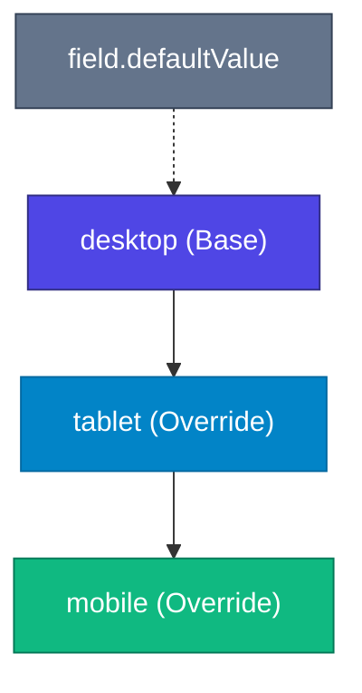

# Responsive Values in iRich

> Architecture specification and developer documentation for first-class responsive values, breakpoint overrides, and cascading inheritance in iRich.

---

## Overview

iRich treats responsive values as a first-class citizen across `@irich/core`, `@irich/renderer`, `@irich/react`, and the property inspector.

Rather than duplicating documents or creating breakpoint-specific document trees, iRich embeds breakpoint overrides directly inside component properties while maintaining strict JSON serializability and immutable state semantics.

---

## Breakpoints

iRich defines three standard editor viewport breakpoints:

| Breakpoint | Target Viewport | Default Canvas Width |
| :--- | :--- | :--- |
| `desktop` | Large screens / desktop (Base) | `100%` |
| `tablet` | Medium devices / tablets | `768px` |
| `mobile` | Small devices / mobile phones | `375px` |

---

## Canonical JSON Serialization Format

Responsive properties are stored in standard JSON as either:
1. **A Base Scalar**: When no breakpoint overrides exist or when the field is non-responsive.
2. **A Responsive Dictionary (`ResponsiveObject<T>`)**: When one or more breakpoint overrides are configured.

### Example 1: Scalar Value (No Overrides)

```json
{
  "id": "heading-1",
  "type": "Heading",
  "props": {
    "text": "Responsive Headline",
    "align": "left"
  }
}
```

### Example 2: Breakpoint Overrides

```json
{
  "id": "heading-1",
  "type": "Heading",
  "props": {
    "text": "Responsive Headline",
    "align": {
      "desktop": "left",
      "mobile": "center"
    }
  }
}
```

### Example 3: Multi-Breakpoint Layout Overrides

```json
{
  "id": "container-1",
  "type": "Container",
  "props": {
    "padding": {
      "desktop": "large",
      "tablet": "medium",
      "mobile": "small"
    },
    "layout": {
      "desktop": "grid-3",
      "tablet": "grid-2",
      "mobile": "vertical"
    }
  }
}
```

---

## Cascading Inheritance & Fallback Rules

Responsive values resolve deterministically using cascading inheritance:



### Resolution Order

1. **Resolving `mobile`**:
   - `value.mobile` (if defined)
   - `value.tablet` (if defined)
   - `value.desktop` / scalar value (if defined)
   - `fieldDefinition.defaultValue`

2. **Resolving `tablet`**:
   - `value.tablet` (if defined)
   - `value.desktop` / scalar value (if defined)
   - `fieldDefinition.defaultValue`

3. **Resolving `desktop`**:
   - `value.desktop` / scalar value (if defined)
   - `fieldDefinition.defaultValue`

---

## Declaring Responsive Fields

Fields do NOT become responsive automatically. Component definitions must explicitly opt in using `responsive: true`.

```typescript
import { defineComponent } from '@irich/core';

export const HeadingComponent = defineComponent({
  type: 'Heading',
  label: 'Heading',
  fields: {
    text: {
      type: 'text',
      label: 'Text',
      defaultValue: 'Section Heading',
    },
    align: {
      type: 'select',
      label: 'Alignment',
      defaultValue: 'left',
      responsive: true, // Opt into breakpoint overrides
      options: [
        { label: 'Left', value: 'left' },
        { label: 'Center', value: 'center' },
        { label: 'Right', value: 'right' },
      ],
    },
  },
});
```

---

## Non-Destructive Editing in Inspector

When a responsive field is edited:
- In `desktop` view: Modifying the value updates the base / desktop value.
- In `mobile` view: Modifying the value sets a mobile override `{ desktop: '...', mobile: '...' }` without altering the desktop value.
- In `tablet` view: Modifying the value sets a tablet override `{ desktop: '...', tablet: '...' }` without altering the desktop value.

---

## SSR & Rendering Resolution

In `@irich/renderer`, responsive values are resolved for the active breakpoint before component renderers receive their props:

```tsx
import { IRichRenderer } from '@irich/renderer';

// Server-side rendering at mobile breakpoint
<IRichRenderer
  document={document}
  components={components}
  breakpoint="mobile"
/>
```

Because resolution is pure and deterministic without browser DOM dependencies, it executes identically in Node.js, Next.js Server Components (RSC), Edge runtimes, and client browsers.
